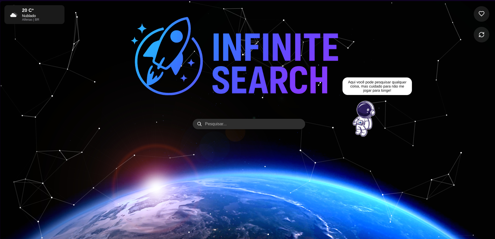

# 🔍 InfiniteSearch

[](https://www.oracle.com/java/)
[](https://spring.io/projects/spring-boot)
[](https://www.elastic.co/elasticsearch/)
[](https://react.dev/)

---



---

## 🧠 Sobre o Projeto

**InfiniteSearch** é uma aplicação full-stack que implementa um mecanismo de **busca inteligente com Elasticsearch**, incluindo:
- 🔍 **Tratamento completo de queries** (match, bool, fuzzy, etc.)
- ✨ **Autocomplete** com base em prefixos
- 💡 **Sugestão de correções (Suggest API)**

Tudo isso com uma interface moderna e responsiva construída com **React**, **animações visuais** e **exibição dinâmica de resultados**.

---

## ⚙️ Tecnologias Utilizadas

### 🔧 Back-end (Java + Spring Boot)

| Tecnologia | Finalidade |
|-----------|------------|
| **Spring Boot** (`starter-web`, `starter-test`) | Estrutura principal e testes |
| **Elasticsearch Java API Client** | Comunicação direta com o cluster Elasticsearch |
| **Elasticsearch REST Client** | Cliente HTTP de baixo nível |
| **springdoc-openapi-ui** | Geração de documentação da API (Swagger) |
| **OpenAPI Generator Plugin** | Geração de modelos/interfaces REST a partir de um YAML |
| **Jackson** (`jackson-databind`, `nullable`) | Conversão JSON e suporte a campos nulos |
| **javax.validation / annotation / servlet-api** | Validações e suporte a API JavaEE |
| **sslcontext-kickstart** | Configuração simples de conexões HTTPS seguras |

---

### 🎨 Front-end (React)

| Biblioteca | Finalidade |
|------------|------------|
| **React** | Framework principal para construção da interface |
| **React Router DOM** | Roteamento SPA |
| **Axios** | Comunicação HTTP com a API |
| **dotenv** | Variáveis de ambiente |
| **Framer Motion** | Animações declarativas |
| **react-tsparticles + tsparticles** | Efeitos visuais com partículas |
| **Tippy.js React** | Tooltips leves e elegantes |
| **Heroicons, Lucide, Feather Icons** | Ícones modernos SVG |
| **React Icons** | Coleção de ícones de múltiplas bibliotecas |

---

## ▶️ Como Executar

### 🔙 Back-end (Spring Boot)
```bash
# Compile e execute com Maven
./mvnw spring-boot:run
```

### 🔙 Front-end (React)
```bash
# Instale dependências
npm install

# Rode localmente
npm start
```
